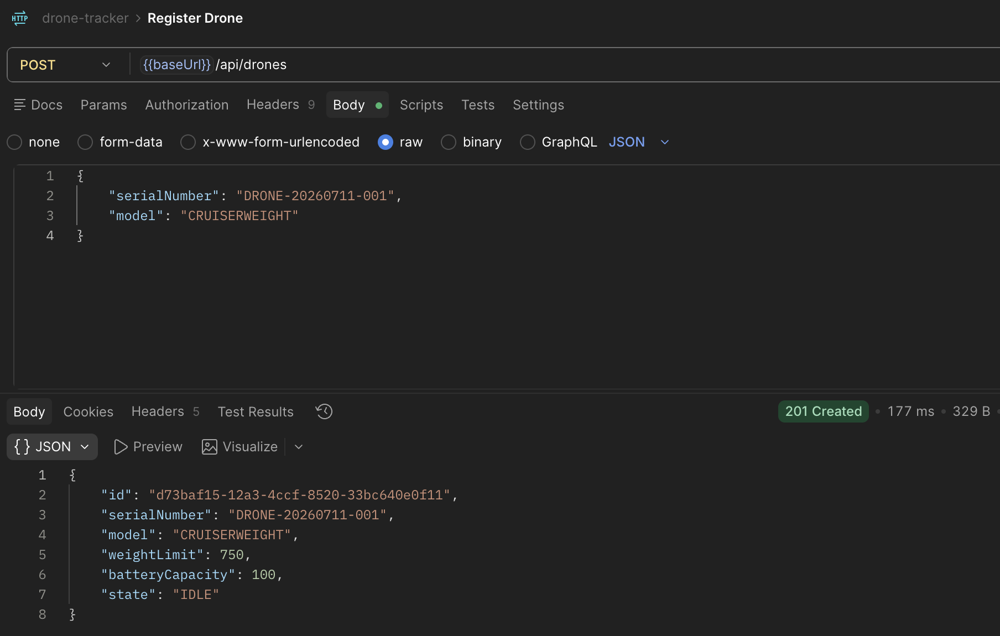
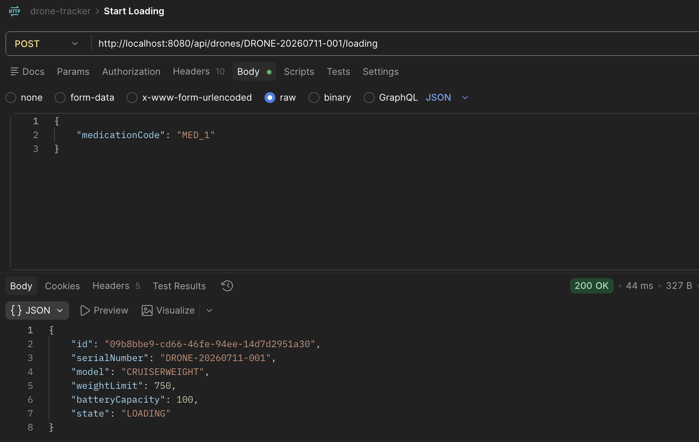
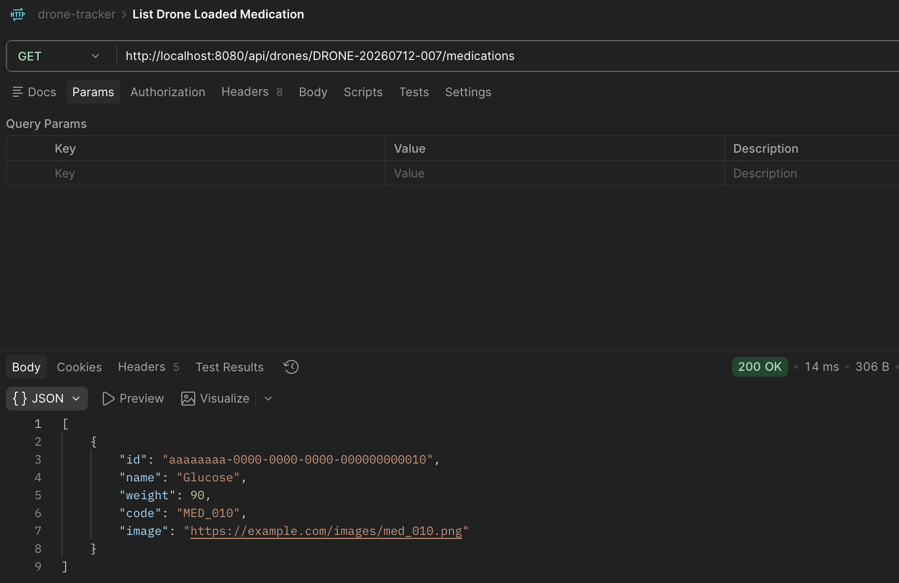
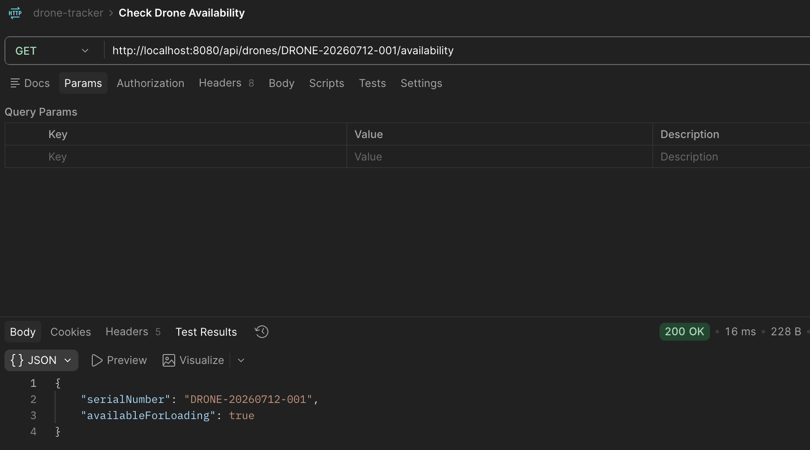
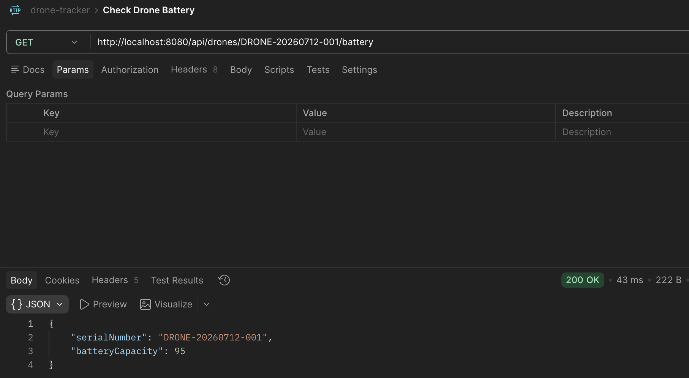

# Drone Tracker API

Spring Boot REST API for tracking drones and loaded medications.

## Tech Stack

- Java 25
- Spring Boot 3.5.x
- Spring Web
- Spring Data JPA
- Spring Validation
- H2 Database
- Maven Wrapper

## Run

```bash
./mvnw spring-boot:run
```

The app starts with an in-memory H2 database and loads seed data on startup.

H2 console:

- URL: `http://localhost:8080/h2-console`
- JDBC URL: `jdbc:h2:mem:drone_tracker`
- User: `sa`
- Password: empty

## Build

```bash
./mvnw clean package
```

## Test

```bash
./mvnw test
```

## API Overview

- `POST /api/drones` registers a drone
- `POST /api/drones/{serialNumber}/loading` loads one medication onto a drone
- `POST /api/drones/{serialNumber}/loading/complete` completes loading and marks the drone as `LOADED`
- `GET /api/drones/{serialNumber}/medications` lists loaded medications for a drone
- `GET /api/drones/{serialNumber}/availability` checks whether a drone is available for loading
- `GET /api/drones/{serialNumber}/battery` returns the drone battery level

## Postman Evidence

### Register Drone



### Load Drone



### Check Loaded Medication



### Check Drone Availability For Loading



### Check Drone Battery



## Notes

- The application uses `data.sql` for initial seed data.
- Hibernate creates and drops the schema on startup and shutdown in the current setup.
